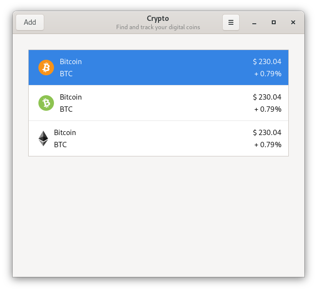

# Crypto

> Find and track your digital coins



## 🛠 Compile

You can install Cryptocurrency from source

### Install Dependencies

- `gtk+-3.0>=3.18`

### Compile & Run

```sh
meson build
cd build
ninja
```

## 👾 TODO

+ [ ] Layout
  + [x] Images
  + [x] HeaderBar
  + [ ] Settings menu (popover)
  + [ ] About window
+ [ ] Build system (meson)
  + [x] Basic setup
+ [ ] Translations
+ [ ] Packages
  + [ ] Elementary
  + [ ] Flathub
+ [ ] General
  + [ ] Add a License
  + [ ] Contribuition guideline
  
